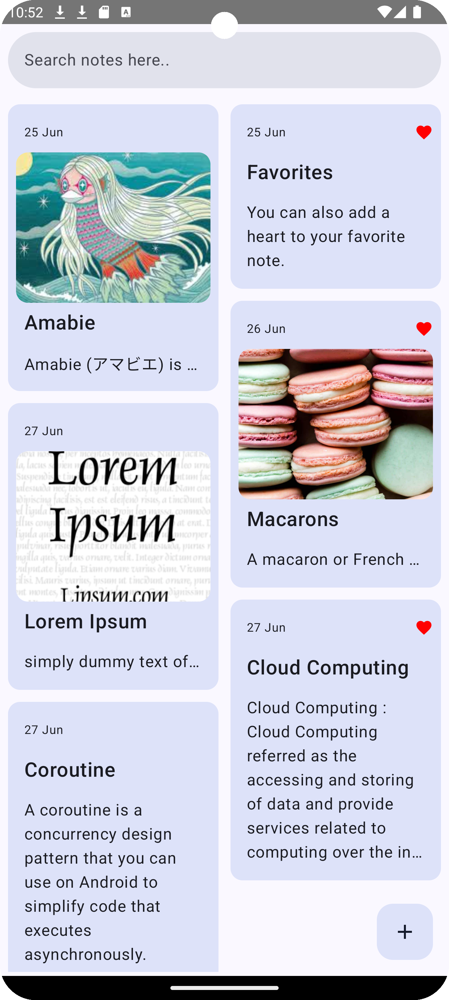

# Notes App

Welcome to the Notes App, an Android application built with Kotlin, Jetpack Compose, and Room Database. This app allows users to create, edit, and delete notes efficiently.

## Features

- **Create Notes**: Add new notes with a simple and intuitive interface.
- **Edit Notes**: Modify existing notes easily.
- **Delete Notes**: Remove notes you no longer need.
- **Persistent Storage**: All notes are saved locally using Room Database.

## Screenshots

  

## Architecture

This project follows the MVVM (Model-View-ViewModel) architecture pattern to maintain a clean separation of concerns and improve testability.

## Technologies Used

- **Kotlin**: The programming language used for Android development.
- **Jetpack Compose**: Modern toolkit for building native UI.
- **Room Database**: Persistence library for local database storage.

## Usage

1. **Home Screen:**
   - View all your notes in a list.
   - Click on a note to edit it.
   - Long click to delete a note.
   - Add a heart to a favorite note.

2. **Create Note:**
   - Click the `+` button to add a new note.
   - Enter the note title and content.
   - Click `✔` to store the note.

3. **Edit Note:**
   - Click on an existing note from the home screen.
   - Modify the title or content.
   - Click `✔` to save changes.

## Acknowledgments

- [Jetpack Compose Documentation](https://developer.android.com/jetpack/compose/documentation)
- [Room Database Documentation](https://developer.android.com/training/data-storage/room)
- [Kotlin Documentation](https://kotlinlang.org/docs/home.html)

---

*This README was generated with ❤️ by [Anchana Reghu](https://github.com/anchanareghu).*
